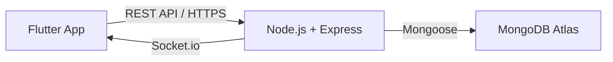

<div align="center">

# 🏥 Saksham Smart Care Management System

**A Smart Elderly Care Management Platform connecting Admins, Caretakers, and Families.**

[](https://flutter.dev)
[](https://nodejs.org/)
[](https://www.mongodb.com/)
[](https://expressjs.com/)
[](https://jwt.io/)

<p align="center">
    <a href="#-project-overview">Overview</a> •
    <a href="#-key-modules">Modules</a> •
    <a href="#-features">Features</a> •
    <a href="#-tech-stack">Tech Stack</a> •
    <a href="#-installation--setup">Setup</a> •
    <a href="#-test-credentials">Demo</a>
</p>

</div>

---

## 🌟 Project Overview

Managing care for the elderly in modern high-paced lives is a challenge. **Saksham** (meaning 'Capable' in Sanskrit) is a comprehensive Smart Care Management System designed to bridge the gap between healthcare facilities, staff, and family members. 

It streamlines administrative tasks, empowers caretakers with digital tools, and provides families with real-time peace of mind regarding their loved ones' health and well-being.

### Why Saksham?
- **Modernizing Care**: Replaces paper logs with a high-performance digital ecosystem.
- **Transparency**: Every medicine administered and every vital recorded is logged and shared.
- **Efficiency**: Specialized dashboards for each role to reduce cognitive load.
- **Trust**: Secure data handling ensuring privacy and reliability.

---

## 🎭 Key Modules

The platform is built on a robust tri-role architecture:

### 🛠️ Admin Dashboard
The command center for facility management.
- **Staff Operations**: Complete CRUD for caretakers and medical staff.
- **Resident Records**: Centralized database for all residents with detailed profiles.
- **Insightful Reports**: Automated generation of health and activity reports.
- **Analytics**: Visualization of facility performance and care quality.

### 🧤 Caretaker Interface
A practical, task-oriented workspace for frontline staff.
- **Daily Checklist**: Real-time task management to ensure zero missed activities.
- **Medicine Tracker**: Strict tracking of dosage, timing, and adherence.
- **Vitals Logger**: Quick entry for BP, Heart Rate, Oxygen, and Temperature.
- **Assigned Resident Views**: Focused access to information for specific residents.

### 🏠 Family Member Portal
A warm, accessible window for family members.
- **Resident Health Status**: At-a-glance health dashboard of their linked relative.
- **Medicine Logs**: Verification of care quality and medication adherence.
- **Event Planner**: Calendar view of facility activities and medical appointments.
- **Real-time Notifications**: Alerts for emergency situations or important updates.

---

## ✨ Features

- **[x] Secure Role-Based Access Control (RBAC)**: Distinct permissions for Admin, Caretaker, and Family.
- **[x] Medicine Adherence System**: Digital verification of medication delivery.
- **[x] Live Vitals Monitoring**: Graphical trends of health indicators.
- **[x] Resident Profile Management**: Comprehensive digital folders for each resident.
- **[x] Staff Performance Logging**: Tracking task completion across shifts.
- **[x] Premium UI/UX**: Minimalist, high-quality design tailored for healthcare use.
- **[x] Real-time Communication**: Integrated alert system for critical updates.
- **[x] Analytics & Reporting**: Data-driven insights for facility owners.
- **[x] Responsive Mobile Experience**: Optimized for all Android and iOS device types.

---

## 🏗️ Project Architecture

Saksham follows a standard **Client-Server-Database** architecture ensuring scalability and security:



- **Frontend**: Flutter (Mobile) acts as the interactive layer for all roles.
- **Backend**: Node.js/Express handles business logic, authentication, and reporting.
- **Security**: JWT-based session management and Bcrypt password encryption.
- **Real-time**: Socket.io for instant health alerts and notification broadcasts.

---

## 🎨 Tech Stack

| Layer | Technology |
| :--- | :--- |
| **Frontend** | Flutter, Dart |
| **State Management** | Provider |
| **Charts** | fl_chart |
| **Backend** | Node.js, Express.js |
| **Authentication** | JSON Web Tokens (JWT) |
| **Database** | MongoDB (Mongoose ODM) |
| **Real-time** | Socket.io |
| **Storage** | Multer (for profile images) |

---

## 📱 Screenshots

<div align="center">
  <table style="width:100%">
    <tr>
      <td width="33%"><br/><sub><b>Admin Dashboard</b></sub></td>
      <td width="33%"><br/><sub><b>Caretaker Workspace</b></sub></td>
      <td width="33%"><br/><sub><b>Family Portal</b></sub></td>
    </tr>
    <tr>
      <td width="33%"><br/><sub><b>Medicine Tracker</b></sub></td>
      <td width="33%"><br/><sub><b>Vitals History</b></sub></td>
      <td width="33%"><br/><sub><b>Resident Profile</b></sub></td>
    </tr>
  </table>
</div>

---

## ⚙️ Installation & Setup

### 📦 Prerequisites
- Flutter SDK (v3.10+)
- Node.js (v18+)
- MongoDB Atlas Account or Local MongoDB Instance

### 🚀 Backend Setup
1. Navigate to the backend directory:
   ```bash
   cd backend
   ```
2. Install dependencies:
   ```bash
   npm install
   ```
3. Create a `.env` file in the `backend` folder:
   ```env
   PORT=5000
   MONGO_URI=mongodb+srv://<username>:<password>@cluster.mongodb.net/saksham
   JWT_SECRET=your_super_secret_key
   ```
4. Start the server:
   ```bash
   npm run dev
   ```

### 📱 Frontend Setup
1. Navigate to the frontend directory:
   ```bash
   cd frontend
   ```
2. Install dependencies:
   ```bash
   flutter pub get
   ```
3. Update API Endpoint:
   Check `lib/services/api_service.dart` to point to your server IP/localhost.
4. Run the app:
   ```bash
   flutter run
   ```

---

## 🔑 Test Credentials

Use these sample credentials to explore the different modules:

| Role | Email | Password |
| :--- | :--- | :--- |
| **Admin** | `admin@saksham.in` | `admin123` |
| **Caretaker** | `caretaker1@saksham.in` | `caretaker123` |
| **Family** | `family1@saksham.in` | `family123` |

---

## 🚀 Future Scope

- **Push Notifications**: Integrated Firebase Cloud Messaging for instant alerts.
- **AI Health Insights**: Predict health anomalies based on vital trends using ML.
- **Web Dashboard**: A specialized web interface for large-screen monitoring.
- **Real-time Chat**: Direct communication channel between Families and Caretakers.
- **NGO Integration**: Specialized version for non-profit elderly care homes.

---

## 🌍 Project Impact

**Saksham** isn't just a management tool; it's a social impact project. By digitizing old-age home operations, we:
- Reduce medical errors in geriatric care.
- Increase transparency for families living far from their loved ones.
- Empower low-skilled staff with structured workflows.
- Create a data-driven approach to healthy aging.

---

## 👤 Author

**Pratham**  
*Lead Developer & UI/UX Designer*  
[GitHub](https://github.com/Prathamcoder3000) | [LinkedIn](https://linkedin.com)

---

## 📄 License

This project is licensed under the **MIT License**. Feel free to use it for academic and non-commercial purposes.

---

<div align="center">
Made with ❤️ for a Smarter Future in Care.
</div>
